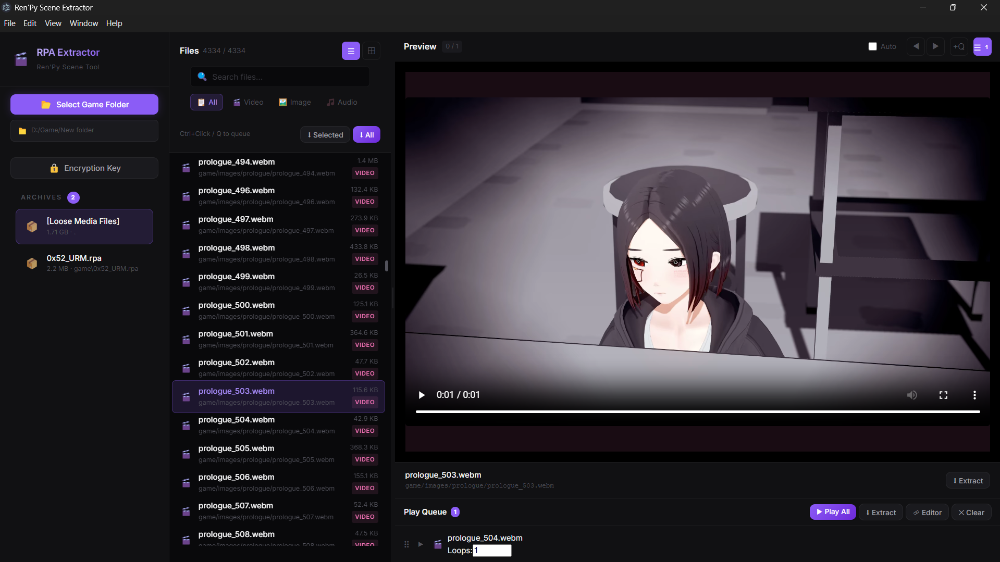
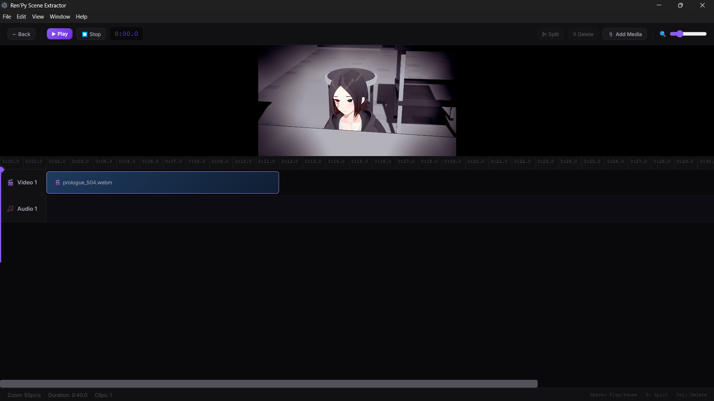

# Ren'Py Scene Extractor

A desktop application for browsing, previewing, and extracting media files from Ren'Py game archives (.rpa files). Supports video, image, and audio files with a built-in timeline editor for arranging clips.

## Features

- Browse and extract files from RPA-2.0, RPA-3.0, and RPA-3.2 archives
- Preview videos, images, and audio directly from archives
- Support for encrypted archives (hex key input)
- Play queue with loop count per item
- Timeline editor for arranging media clips
- Batch extraction with type filtering

## Requirements

- Windows 10 or later
- Python 3.x (must be in PATH)

## Screenshots

### Main Interface

The main window shows the sidebar with archive list, file browser with filters, and media preview panel.

### Timeline Editor

Arrange clips on a multi-track timeline. Trim, split, and combine media files.

## Quick Start

1. Launch the application
2. Click "Select Game Folder" and choose a Ren'Py game directory
3. Select an archive from the sidebar to view its contents
4. Click on a file to preview it
5. Use the extract buttons to save files to your computer

## User Interface

### Sidebar (Left Panel)

| Element | Description |
|---------|-------------|
| Select Game Folder | Opens a folder picker dialog to select a Ren'Py game directory |
| Encryption Key | Opens a dialog to enter a hex key for encrypted archives (icon changes to unlocked when set) |
| Archives List | Shows all .rpa files found in the selected folder. Click to view contents. |

The sidebar also shows loose media files found in the game folder under "[Loose Media Files]".

### File List (Center Panel)

| Element | Description |
|---------|-------------|
| Search Box | Filter files by name |
| Filter Buttons (All/Video/Image/Audio) | Filter files by media type |
| List/Grid Toggle | Switch between list view and grid view |
| Selected | Extract the currently selected file |
| All | Extract all files matching the current filter |

In list view, each file shows its name, path, size, and type. Ctrl+Click to select multiple files. Shift+Click for range selection.

### Preview Panel (Right Panel)

| Element | Description |
|---------|-------------|
| Auto | Toggle auto-play next file when current media ends |
| Prev/Next Buttons | Navigate to previous/next file |
| +Q | Add current file (or selected files) to the play queue |
| Queue Toggle (with count badge) | Show/hide the play queue panel |
| Extract | Save current file to disk |

### Play Queue

The play queue appears below the preview panel when toggled.

| Element | Description |
|---------|-------------|
| Play All | Start playback from the beginning of the queue |
| Extract | Extract all queued files to a folder |
| Editor | Open queued files in the Timeline Editor |
| Clear | Remove all items from the queue |
| Loops | Number of times each item should loop during playback |
| Drag Handle | Reorder items by dragging |

Each queue item shows a play button and a remove button. Click the item name or play button to play that item.

## Keyboard Shortcuts

| Key | Action |
|-----|--------|
| Up / Down Arrow | Navigate to previous/next file |
| Left / Right Arrow | Navigate to previous/next file |
| Q | Add current file to play queue |
| ? | Toggle help guide |

### Timeline Editor Shortcuts

| Key | Action |
|-----|--------|
| Space | Play/Pause timeline |
| S | Split clip at playhead position |
| Delete | Remove selected clip |

## Timeline Editor

The Timeline Editor allows you to arrange media clips on a multi-track timeline.

### Features

- Separate video and audio tracks
- Drag clips to reposition them on the timeline
- Drag clip edges to trim start/end points
- Split clips at the playhead position
- Import external media files
- Zoom in/out on the timeline

### Controls

| Button | Description |
|--------|-------------|
| Back | Return to the main extractor view |
| Play/Pause | Start or pause timeline playback |
| Stop | Stop playback and reset playhead to start |
| Split | Cut the selected clip at the playhead position |
| Delete | Remove the selected clip |
| Add Media | Import external video/audio/image files |
| Zoom Slider | Adjust timeline zoom level |

The playhead (red vertical line) shows the current playback position. Click anywhere on the timeline to move the playhead.

## Encryption Keys

Some Ren'Py archives are encrypted. If you encounter an error when opening an archive (zlib or pickle errors), you may need to enter the encryption key:

1. Click the "Encryption Key" button in the sidebar
2. Enter the hex key (e.g., `0x12345678`)
3. Click Apply
4. Try opening the archive again

The encryption key is typically found in the game's source files (look for `.rpy` files containing archive definitions).

## File Type Support

### Preview Support

| Type | Formats |
|------|---------|
| Video | webm, mp4, mkv, avi, ogv, mov, flv |
| Image | png, jpg, jpeg, gif, bmp, webp, tga |
| Audio | mp3, wav, ogg, flac, aac, opus |

### Extraction

All file types in the archive can be extracted, including scripts, fonts, and other game assets.

## Tips

- Use the search box to quickly find specific files
- Ctrl+Click multiple files, then press Q to add them all to the queue at once
- Set loop counts in the queue for repeated playback of specific clips
- The timeline editor auto-places clips on the appropriate track (video/image on video track, audio on audio track)

## Troubleshooting

### "Python is not installed or not in PATH"

The application requires Python 3 to be installed and accessible from the command line. Install Python from [python.org](https://www.python.org/) and ensure you check "Add Python to PATH" during installation.

### Archive fails to open with zlib/pickle error

The archive is likely encrypted. Enter the encryption key using the "Encryption Key" button in the sidebar.

### Videos don't play

Some video formats may not be supported by the built-in player. Try extracting the file and opening it with an external media player.

### Preview not loading

If preview shows a loading spinner indefinitely, check the console for errors (View > Toggle Developer Tools). The file may be corrupted or in an unsupported format.

## License

MIT License